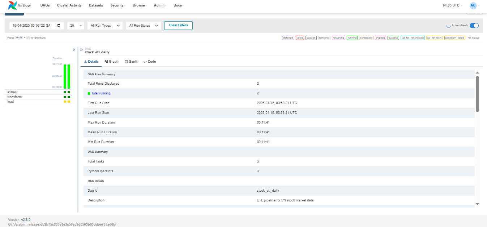
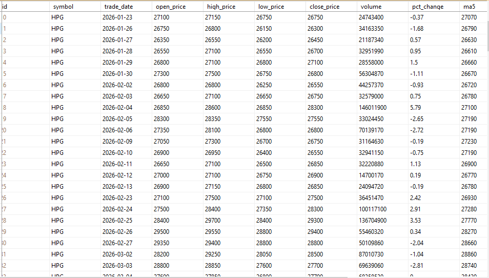
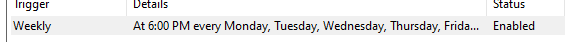

# ETL Pipeline — Vietnamese Stock Market

## Overview
An automated ETL pipeline that fetches daily stock data
for major Vietnamese banking/finance stocks, performs
technical analysis, and loads results into SQL Server.

## Architecture

Yahoo Finance API
      ↓
  Extract (yfinance + retry decorator)
      ↓
  Transform (Pandas: clean, MA5/MA20, pct_change)
      ↓
  Load (SQL Server: upsert, no duplicates)
      ↓
  Orchestrated by Apache Airflow (DAG: stock_etl_daily)
  Scheduled: 18:00 ICT, Mon–Fri

## Tech Stack
- Python 3.11 · Pandas · yfinance · SQLAlchemy · pyodbc
- Apache Airflow 2.8 · SQL Server 2021
- Logging: Python built-in logging (file + console)
- Error handling: Custom exceptions + exponential backoff

## Key Features
- Modular architecture: extract / transform / load separated
- Retry with exponential backoff (2s → 4s → 8s)
- Structured logging to daily log files
- Upsert logic prevents duplicate records
- Airflow DAG with task-level retry and monitoring

## How to Run
pip install -r requirements.txt
python etl.py or python main.py

## Database Schema
Table: stock_daily
- symbol (NVARCHAR) · trade_date (DATE) — UNIQUE together
- open/high/low/close_price (FLOAT) · volume (BIGINT)
- pct_change · ma5 · ma20 · vol_ma5 (FLOAT)

## Screenshots
[DAG Graph view — Airflow UI]
[Task logs — Airflow UI][alt text](image.png)
[Data in SQL Server — SSMS]
[Screenshot của Task Scheduler]
